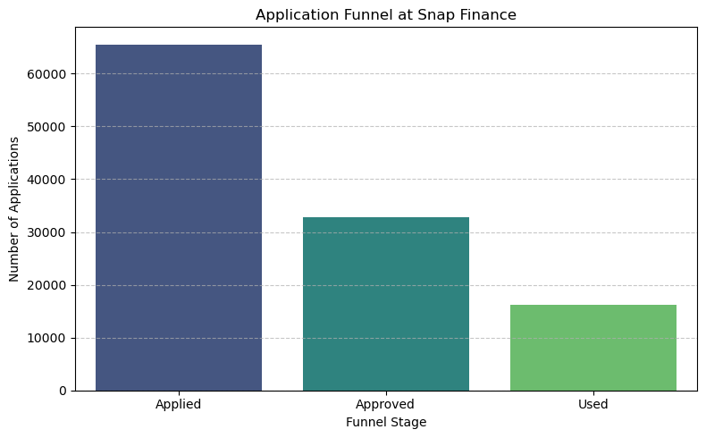
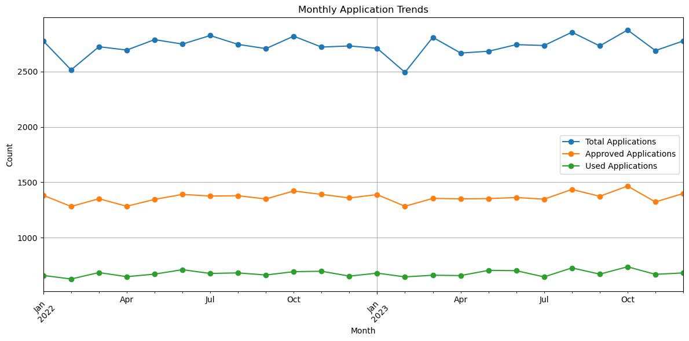

# Task 1 : Calculate the number of applications, number of approved, and the number of used applications and visualize the trend over the submission date.

---

### Objective 

## Why do we need this?
Being a financing business, our end goal is the customers who used the amount that they had been approved for. Now, we need to analyze the lifecycle of customer applications from applying, to getting approved, to actually using the financing product. This flow represents a typical **application funnel**, and our job is to uncover how well it's performing.

---

## Why These Visualizations Were Chosen
Instead of showing too many charts and confusing stakeholders, I focused on **two simple but powerful visualizations**:

1. A **time-based line chart** showing weekly and monthly performance
2. A **conversion funnel bar chart**

These two views help answer the most important questions:
- “**How do our applications trend over time?**”
- “**How well are we converting users at each stage?**
  

---

## Visualization 1:  Application Funnel Bar Chart

This chart compares:
- **Total Applications** — customers who applied
- **Approved Applications** — those who got approved
- **Used Applications** — customers who actually used the financing
  
## Key Insights

## What do we see from this chart?

### There is some seasonality around the Jan-Feb time indicating end of holiday season or business slowdown for the stores.

### The Funnel is Leaky
- There is a clear **funnel drop-off** between each stage.
- Only around **50% of applicants get approved**. This might be a bummer at first sight but this might not be as bad as it looks. It might show that the company is aware of its risk-rewward ratio.

### Usage Is the Bottleneck, Not Acquisition
- But another interesting thing we observe here is, **only a small portion of approved customers actually use the product**.
- This gap might actually be critical and we might need to explore **why customers are not completing the financing process** it might be due to Gaps in user experience, or users might not be we aware of the next steps, or the lease costs seem to much, or maybe they dont need money anymore? 

---

## Visualization 2: Monthly Trend Chart

This line chart shows how applications behave **over time** one by **week** and one by **month**.

## Key Insights

### What do we notice from these charts?
- **Monthly Trend** smooths this data and shows a consistent flow of applications.
- Trend confirms that while **applications and approvals stay steady**, **usage remains much lower** in every time period.
- This consistency across time confirms that the funnel issue is **systemic** not caused by any one-time event.
- But this is just stagnant growth. If we need to grow further we need to amp up and analzye where we are lacking behind and be at the top of our game.

---

## Why did I not make 10 charts?

These charts were kept intentionally simple clean, clear, and useful for both technical and non-technical teams. They directly reflect:
- **Conversion efficiency**
- **Time-based behavior of users**
- **Where we might lose customers**

