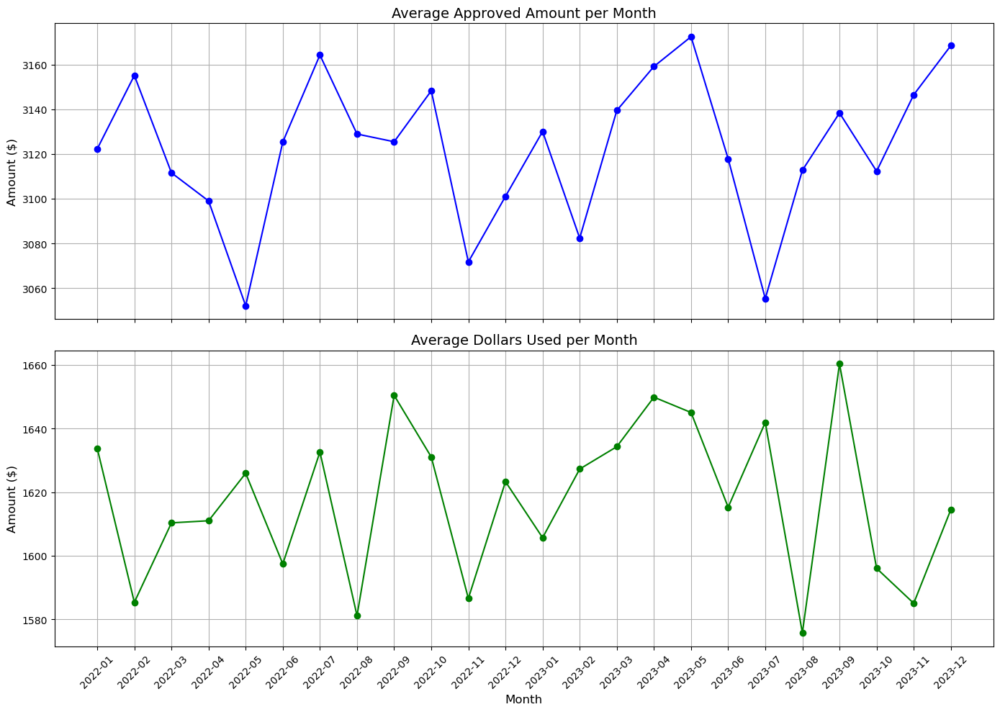
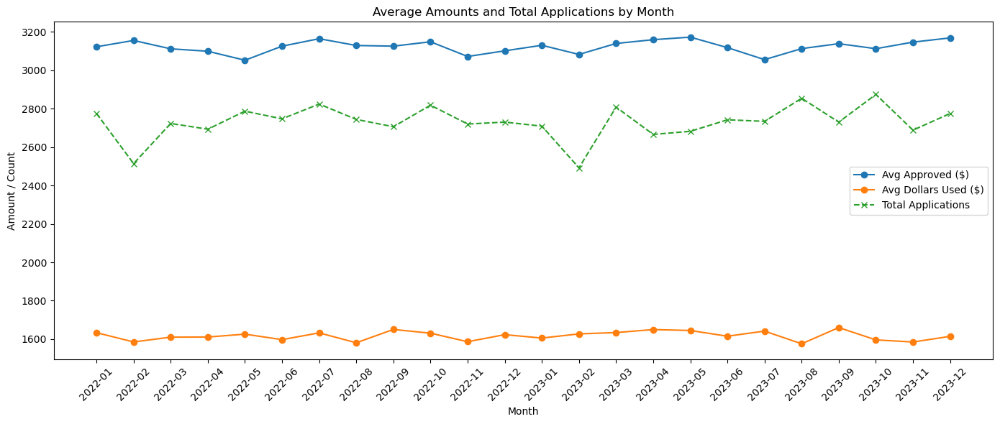

## Task 2 – Monthly Trends in Approved Amount vs Dollars Used

### 📝 Objective
Analyze the monthly trends of average **approved amounts** and **dollars used** to uncover behavioral or strategic patterns.

---

### Visualization Summary

Two line plots were created:
- **Average Approved Amount per Month**
- **Average Dollars Used per Month**

These values represent monthly averages, not totals.

---

### Key Observations

1. **Inverse Trend Pattern**  
   - When **approved amounts increase**, the **dollars used** tend to dip — and vice versa.
   - This consistent inverse movement suggests a reactive relationship.

2. **Possible Business Strategy: Risk Control**  
   - The company may be **intentionally lowering future approvals** when it sees a spike in dollar usage.
   - This could be a credit risk mitigation strategy to **avoid customer overleveraging**.

3. **Adaptive Credit Behavior**  
   - Approval limits may not be static.
   - Instead, the company could be using **real-time usage data** to **adjust approvals dynamically**, possibly using automated thresholds.

---

### Insight

> **“Customer behavior may be influencing future approval decisions. Higher dollar usage could be triggering conservative approval strategies.”**

This highlights an intelligent, data-driven credit policy, and sets the stage for further lag-based correlation or segmentation analysis.

---

