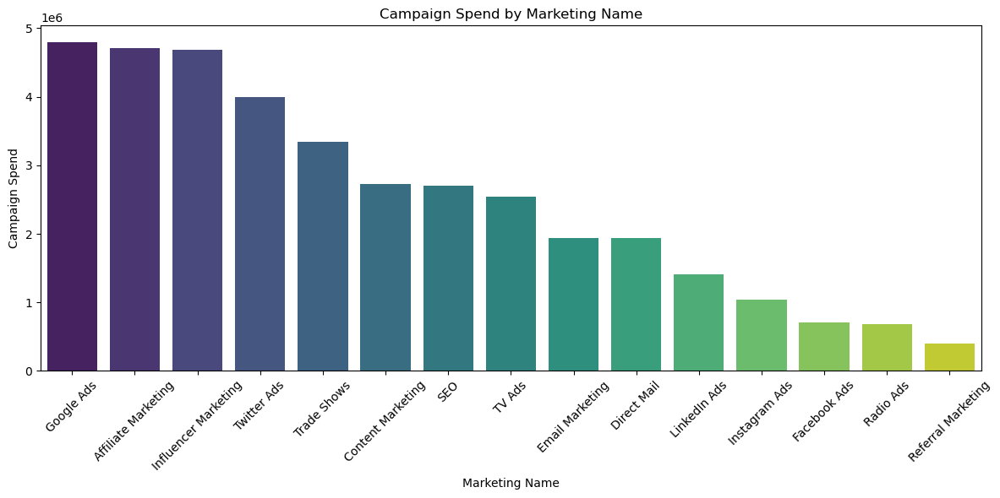
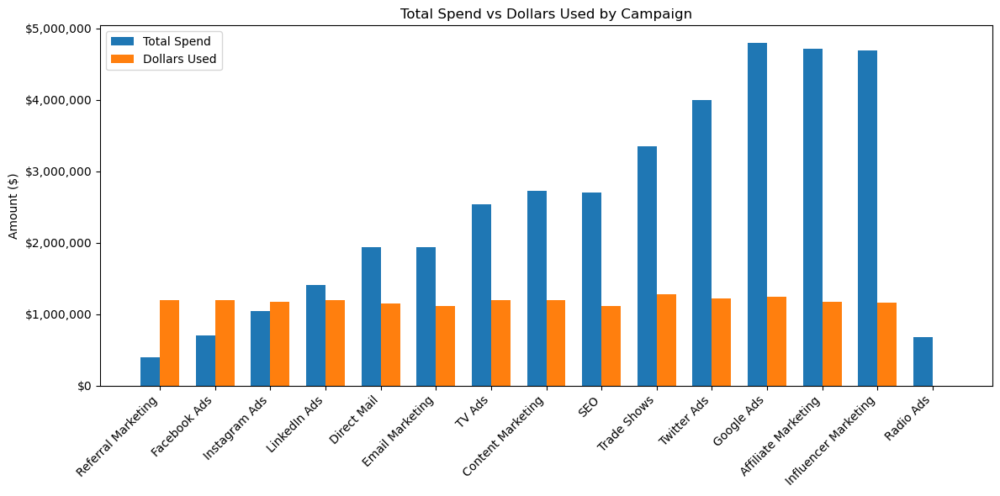

# Task 4 – Create a view with a graph to compare the used dollars amount by Marketing name, and color by spend amount.

---

## Objective

The goal of Task 4 was to evaluate the **performance of marketing campaigns** at Snap Finance in terms of:

- Customer acquisition
- Dollar utilization
- Marketing spend efficiency

This analysis would help identify **which campaigns are worth scaling**, which are underperforming, and where optimizations are possible.

---

## 🧠 What Was Done

- Used SQL to aggregate key metrics from the `applications`, `customers`, and `marketing` tables.
- Calculated:
  - Total applications received per campaign
  - Total and average approved amounts
  - Total dollars actually used
  - Conversion Rate = (Used Amount / Spend)
- Filtered out `"No Campaign"` to focus on actionable campaigns
- Visualized results in Python (Matplotlib) for clarity.

---

## 📊 Visualizations

### 1. Total Spend vs Campaigns
> Compares the budget invested in each campaign.

---

### 2. Total Spend v/s Money Used for that Campaign
> Shows how effectively each campaign turned marketing dollars into actual usage.

---

## Key Insights

### Referral Marketing is a Goldmine
- **Highest conversion rate (305%)** with one of the **lowest budgets**.
- It’s a compounding loop — existing customers bring high-intent users.
- Also had **consistently high approval and usage rates**.

---

### Facebook, Instagram, LinkedIn – High Efficiency Channels
- Moderate spend, but **strong conversions**.
- Campaigns like these are worth **doubling down**, especially since approval and usage rates align well.

---

### Google & Twitter Ads – High Spend, Low Yield
- Google Ads had **one of the highest spends**, but conversion was just ~26%.
- Twitter Ads followed a similar pattern.
- These are expensive channels with **poor ROI**, likely due to weak targeting or unoptimized creatives.

---

### Radio Ads – Complete Disconnect
- Despite spend, **no recorded conversions**.
- This could be due to:
  - Misattribution in data
  - Campaign not linked properly to customer journeys
- Needs to be audited immediately.

---

### Volume Looks Uniform, But Behavior Isn’t
- Most campaigns had around **2,900–3,100 applications**, yet dollar usage and approval rates **differed wildly**.
- Shows that **quantity ≠ quality** when it comes to acquisition.

---

## Strategic Reflections (Tied to Previous Tasks)

- In Task 1, we saw that **many applications didn’t lead to dollar usage**. This breakdown by campaign explains **why** — not all acquisition sources are equal.
- In Task 2, we saw a pattern where **approved amounts stayed flat** but **dollar usage fluctuated**. This further supports the idea that **spend strategy** must align with **customer intent** — and that intent comes from where customers originate.
- This analysis completes the funnel view by mapping **source → spend → approval → usage**.

---
