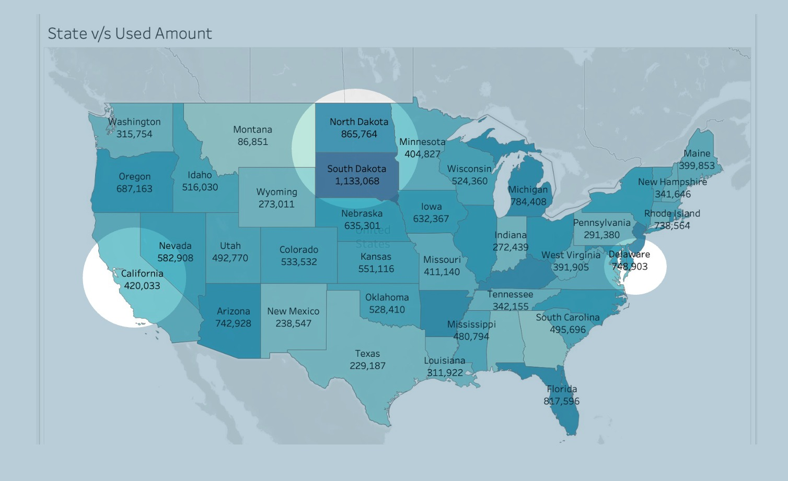
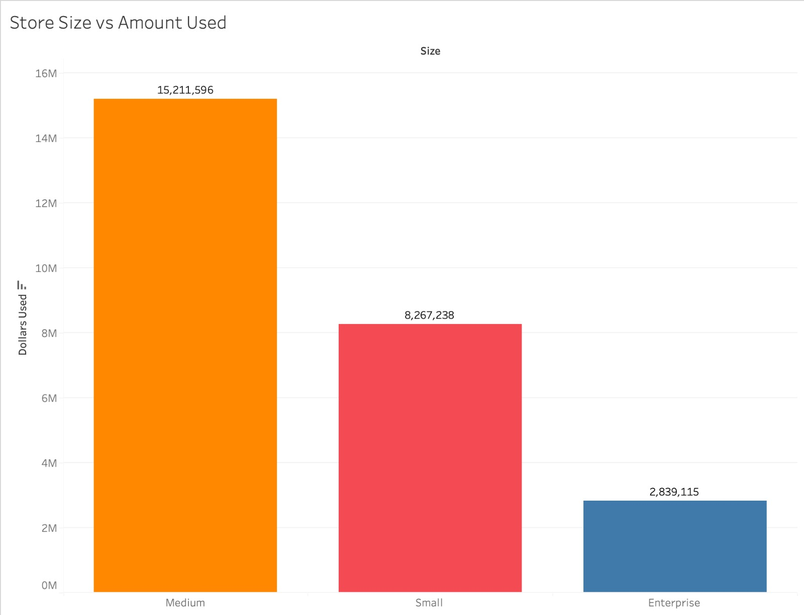
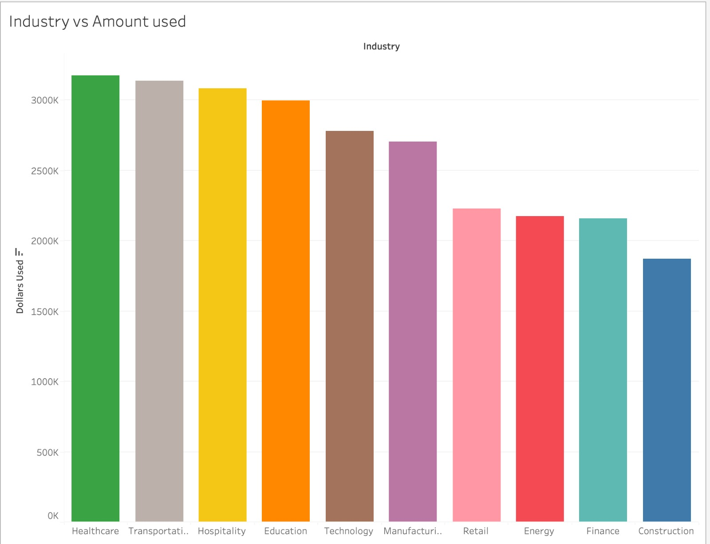
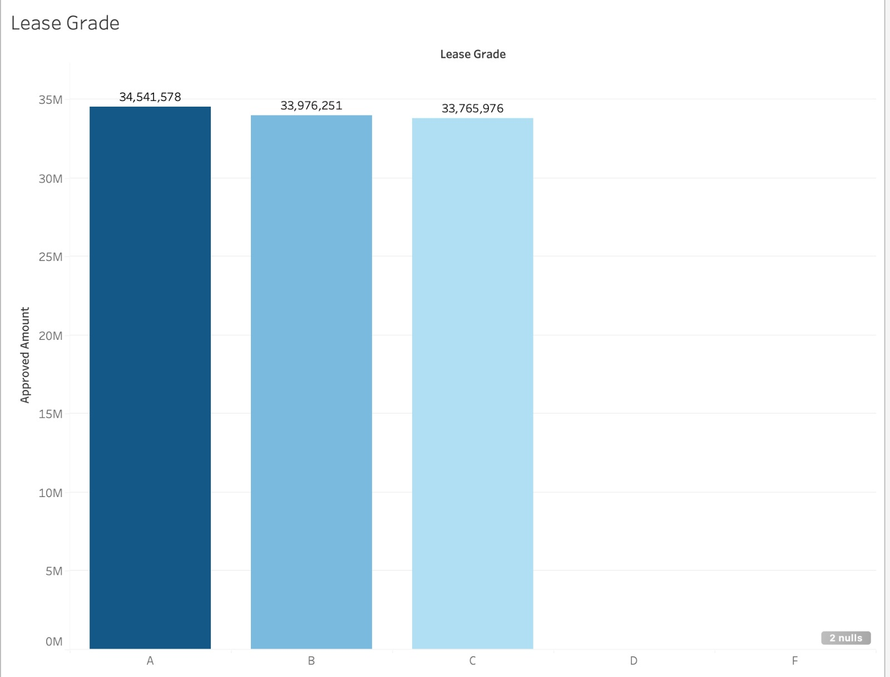
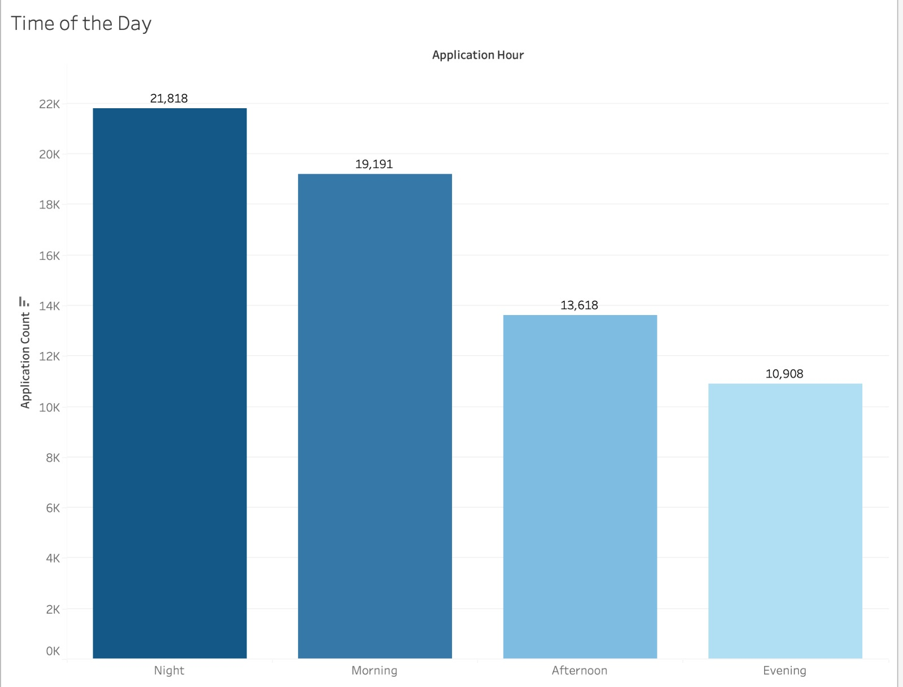

## Task 5 - Come up with something interesting with the data to share with us. Keep in mind this is randomly generated sample data so trends may or may not be present, but don’t let that hold you back.

### So what was something interesting that I found?

So while I was done working with data in python, I realized, which not load this in tableau and see analyze it there!
And I started looking for interesting patterns, trends or something that could stand out to me. 

While exploring the dataset, I came across some unexpected trends worth sharing. Lets look at them one by one.

## 1. South Dakota is the Biggest Seller

We typically expect high-population states like **California**, **Texas**, or **New York** to top the charts in terms of **total dollars used**  but the data told a different story.

### 🌟 States That Outperformed Expectations were States like:
- **South Dakota**
- **North Dakota**
- **Delaware**

These states showed **exceptionally high usage volume**, despite having **comparatively small populations**.

Meanwhile:
- **California** and **Texas** usually at the top of everything, ranked surprisingly low in usage amount. Maybe a higher competition from alternative lenders and credit options. 

### 🧐 So What Could This Mean?
- These states might have **higher customer engagement** or more adoption at the merchant level or Limited access to traditional financing.
- Or maybe Snap's financing just resonates more strongly with customers in these regions.
- Could also hint at untapped opportunity **other smaller states might be just as profitable** if approached correctly.
- Or revising marketing patterns for bigger states and trying a different marketing strategy for them.

### 📌 Final Thought
This isn’t just a fun anomaly. It could be a **lead** for deeper segmentation analysis and strategic marketing focus.  
Sometimes the best markets aren’t the biggest they’re just the most engaged.

___

## 2. Medium-Sized Stores Dominate the Used Dollars

We often assume that **enterprise-level stores**, with their bigger infrastructure and reach, would lead the charts in terms of **dollar usage**. But this financing data says otherwise.

### Who Came Out on Top?

The top performer wasn’t the biggest it was the **Medium-sized stores**.

### Store Size Rankings by Dollar Usage:
- **Medium** – Over **$15 million** used!
- **Small** – Respectable **$8.2 million**
- **Enterprise** – Only **$2.8 million**, despite being ‘large’

---

### What Might Be Happening Here?

- **Medium Stores: Snap’s Sweet Spot**
  - These stores likely offer services/products priced perfectly for **the $1250 - $5000 lease amount around which this plan revolves**.

- **Small Stores: Punching Above Their Weight**
  - These are likely serving **urgent needs** like auto repairs, basic healthcare, or electronic or customers at these stores might have **fewer financing options**, making Snap more appealing.

- **Enterprise Stores: Underdelivering**
  - Likely selling **higher-ticket items** that exceed Snap’s current cap. These stores may have access to **other financing partners** or in-house credit options.

---

### Strategic Signals

- **Loan Amount Matters:** Since loans max out at ~$5,000, store categories selling within this range are naturally better performers.
- This doesnt mean we cannot capitalize on Enterprise stores. Maybe a person buying a new car might need snap finance to add new accessories. 
- But apart from that, **Medium is the Moment:** If we're thinking of scaling reach, **doubling down on medium-sized stores** seems like a data-backed move.

---

### Final Thought
This analysis shows sometimes, it’s not about going big it’s about going **relevant**.

---

## 3. Healthcare Leads Industry-Wise Usage

When grouped by industry, **Healthcare**, **Transportation**, and **Hospitality** emerged as the **top 3 verticals** driving Snap usage.

---

### Quick Observations

- **Healthcare** took the top spot likely driven by urgent, essential services where financing plays a key role (e.g., dental, optical, urgent care).
- **Transportation** and **Hospitality** followed closely, possibly due to **vehicle repairs**, **hotel bookings**, and **short-term travel needs**.
- Industries like **Construction**, **Finance**, and **Energy** saw lower usage, which could be due to:
  - Larger average ticket sizes exceeding our range cap
  - Presence of in-house or commercial financing alternatives
  - Less urgent or infrequent purchases

---

### What This Tells Us

- Snap usage spikes where purchases are **urgent**, **mid-ticket**, and **consumer-facing**.
- This chart can help **prioritize onboarding efforts** into industries with untapped potential but similar purchase behavior.

---

### Final Thought

> Lets focus less on the vertical’s size and more on the **urgency and accessibility** of their services to end consumers. That’s where we win.

---

## 4. Lease Grade vs Approved Amount

---

### What do we see here?

- Grades **A, B, and C** dominate approvals each hitting over **$33M+** in total approved amounts.
- Grades **D and F**? Practically **non-existent** maybe blocked or auto-rejected by Snap's credit policies.

---

### Why This Matters

> Lease grade = Snap’s internal risk profile. This chart shows where Snap’s comfort zone is and where it draws the line.

---
## 5. Best Time of Day to Capture Users

---

### Key Takeaway

- **Night dominates**, over **21.8K applications** came through after 9 PM.
- **Morning** is next.
- **Afternoon & Evening** show relatively very less applicants.

---

### What This Means for Snap?

- If the company is planning campaign pushes or merchant nudges **go heavy at night**.
- Customers seem most active **after hours**, possibly when they’re home, relaxed, and thinking about purchases or repairs.
- This opens up strategic timing for ads, email, or push campaigns to **maximize conversion impact**.

---
---

---

### So What Could We Do Next?

- **Target Medium-sized stores** they drive the highest actual usage.
- **Double down on high-performing states** like **South Dakota** or **North Dakota**, and scout for **the next hidden champions**.
- **Launch and boost campaigns during night hours** when users are actually online and engaging.
- And use the marketing channels which perform the best to capture these users. 

